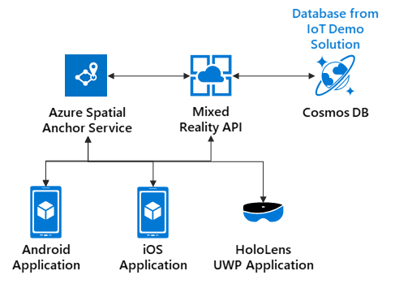
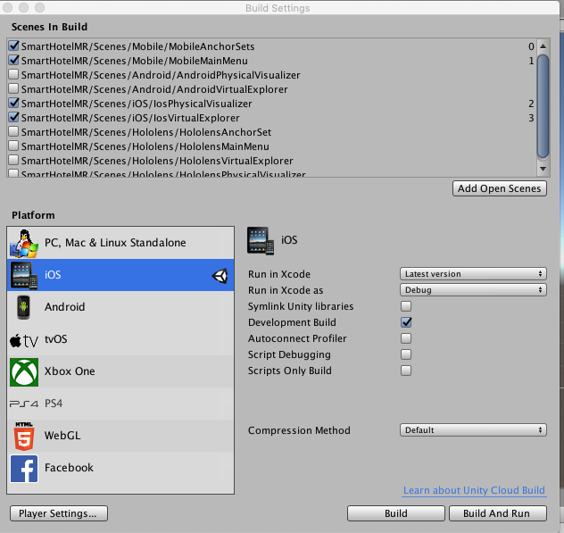

# SmartHotel360
During **Connect(); 2017** event this year we presented beautiful app demos using Xamarin and many features of Azure. This repository contains a mixed reality demo and reference application to show how to integrate the new mixed reality service **Azure Spatial Anchors** in a Unity project using the existing [SmartHotel360 IoT](https://github.com/Microsoft/SmartHotel360-IoT) demo.

# SmartHotel360 Repos

For this reference app scenario, we rely on several apps and services from the SmartHotel360 solution. You can find all SmartHotel360 repos in the following locations:

- [SmartHotel360](https://github.com/Microsoft/SmartHotel360)
- [IoT](https://github.com/Microsoft/SmartHotel360-IoT)
- [Mixed Reality](https://github.com/Microsoft/SmartHotel360-MixedReality)
- [Backend](https://github.com/Microsoft/SmartHotel360-Backend)
- [Website](https://github.com/Microsoft/SmartHotel360-Website)
- [Mobile](https://github.com/Microsoft/SmartHotel360-Mobile)
- [Sentiment Analysis](https://github.com/Microsoft/SmartHotel360-SentimentAnalysis)
- [Registration](https://github.com/Microsoft/SmartHotel360-Registration)

# SmartHotel360 - Mixed Reality Demo

Welcome to the SmartHotel360 Mixed Reality repository. Here you'll find everything you need to run the API and client apps (Android, iOS and UWP for HoloLens) as part of this demo.



[](https://dev.azure.com/smarthotel360/MixedReality/_build/latest?definitionId=34)

## Getting Started

SmartHotel360 deployed a new Mixed Reality solution built on top of **Azure Spatial Anchors** that is compatible with Android and HoloLens devices through Unity to visualize the information of the hotel room sensors used in the Internet of Things (IoT) solutions mentioned below. 

## Demo Scripts

You can find a **[demo script](Documents/DemoScript)** with walkthroughs once you have finished the setup of this demo.

## Setup

### Prerequisites

Prior to following these steps, you should have already completed the steps and deployed the SmartHotel360 IoT solution found in this repository: https://github.com/Microsoft/SmartHotel360-IoT. These steps rely on resources deployed from that solution and this API will not function without those resources.

In addition, you will need:

1. For Android:

        * Windows 10 with Visual Studio 2017 or higher. (You can also use a Mac)
        * Unity Installed with Android Module.
        * Android Studio.
        * Android Mobile Device with Developer Mode enabled.
        
2. For HoloLens:

        * Windows 10 with Visual Studio 2017 or higher.
        * Unity Installed with UWP Module.
        * HoloLens Device with Developer Mode enabled.
        
3. For iOS:

        * Mac with Visual Studio installed.
        * Unity Installed with iOS Module.
        * XCode installed.
        * iOS Device 

### 1. Set up a Service Principal and Register an Azure Active Directory Application

 Follow these instructions to [create a service principal and register an Azure Active Directory (AD) application](https://docs.microsoft.com/en-us/azure/azure-resource-manager/resource-group-create-service-principal-portal?view=azure-cli-latest).

During the creation process you will need to take note of the following information:

- Tenant Id
- App Id
- App Key

> Note: you can use the same [application you created for the IoT demo](https://github.com/Microsoft/SmartHotel360-IoT#set-up-a-service-principal-and-register-an-azure-active-directory-application).

### 2. Set permissions and security for the Application

In the App Registration, click on Settings and then Required Permissions.
* Microsoft Mixed Reality
  * Click `Add` on the top left
  * Under select an API, type `Azure`, then choose `Microsoft Mixed Reality`
    * NOTE: If this option does NOT show, you may need to register the Mixed Reality resource provider using the following steps in a **Powershell** window:
       1. `Login-AzureRmAccount -SubscriptionId {subcription id}`
       2. `Register-AzureRmResourceProvider -ProviderNamespace 'Microsoft.MixedReality'`
       3. Wait until the provider registration is complete, can be checked via: `Get-AzureRmResourceProvider -ProviderNamespace 'Microsoft.MixedReality'`
  * Check the Sign In Access Application Permissions box
  * Save

### 3. Create Azure Resources

In order to run this demo you will need the following resources:

* [Spatial Anchors](https://azure.microsoft.com/en-us/services/spatial-anchors/)
* [App Service](https://azure.microsoft.com/en-us/services/app-service/)
    * Requires an App Service Plan and Application Insight to monitor the API.

We have added an ARM template to automate the creation of the resources:

[](https://portal.azure.com/#create/Microsoft.Template/uri/https%3A%2F%2Fraw.githubusercontent.com%2FMicrosoft%2FSmartHotel360-MixedReality%2Fmaster%2FDeploy%2Fdeployment.json)

> Note: This deployment will only create the resources. It will not deploy the solution.

### 3. Assign permissions to the Azure Spatial Anchors

After creating the resources. You need to assign that application permissions to use the Azure Spatial Anchors account. 

1. Navigate to the newly created Spatial Anchors account in the Azure Portal.
1. Select **Access Control (IAM)**. 
1. Add a role assignment to this resource and select the Role of **Spatial Anchors Account Owner** and select the Application Registration from the first step. 
1. Click **Save**.

### 4. Deploy the API project using Visual Studio

1. Using Visual Studio 2017 or later, open the API solution.
1. Right click on the SmartHotel.MixedReality.API project and click Publish. 
1. Choose the existing App Service that was already have created.
1. Click Publish and wait for the operation to finish. 
1. A new browser window should open and you should see the Swagger UI for the API endpoints.

### 5. Configure the API Application Settings

In the Azure Portal, find the created App Service and navigate to the Application Settings blade. Complete the valuew of the following settings:

1. DatabaseSettings__MongoDBConnectionString - This is the connection string for the SmartHotel360 IoT Cosmsos DB
2. SpatialServices__TenantId - Tenant Id of your Active Directory which the Application Registration was created
3. SpatialServices__AccountId - Account Id of the Azure Spatial Anchors Account
4. SpatialServices__applicationId - Application Id of the Application Registration created in previous steps
5. SpatialServices__applicationKey - Secret of the Application Registration created in previous steps
6. authorizationSettings__ApiKey - Secret api key that is used to protect the Mixed Reality API
7. DigitalTwins__ManagementApiUrl - Management API Url of the SmartHotel360 Digital Twins instance created in previous steps
8. DigitalTwins__ClientId - Application Id of the Application Registration created from the SmartHotel360 IoT. In case you used a different Application.
9. DigitalTwins__ClientSecret - Application secret of the Application Registration used from the SmartHotel360 IoT
10. DigitalTwins__TenantId - Tenant Id of the Azure Active Directory that the SmartHotel360 IoT Solution was deployed in.

> Note: for this step you will need the [User Settings](https://github.com/Microsoft/SmartHotel360-IoT#user-settings) file from the IoT demo.

### 6. Unity

This is a cross-platform Unity project that shares as much C# code and assets as possible between platforms. The **SmartHotelMR** subfolder contains assets and scripts specific to this project. You can build the project  for a specific platform, please refer to the platform sections below.

### 7. Configuring the Unity Project Settings

Before building the Unity project for any platform, you'll need to update the settings.
1. In your project open the **Unity/SmartHotelMR/Assets/SmartHotelMR/Scripts/Globals.cs** file.
1. Fill in the values for your deployed SmartHotelMR Service API URL and API Key as well as your Spatial Anchors Account ID.
    * **ServiceBaseUrl:** is the URL of the App Service where you deployed the SmartHotel.MixedReality.API project.
    * **ApiKey:** is the API Key you used as **authorizationSettings__ApiKey** to protect the API.
    * **SpatialAnchorsAccountId** you can get this value from the Azure Portal in the Overview tab.

### 8. Android (Optional)

1. Make sure you have installed and loaded the [Android module](http://download.unity3d.com/download_unity/6e9a27477296/TargetSupportInstaller/UnitySetup-Android-Support-for-Editor-2018.3.0f2.exe) as part of your Unity setup.

2. The Android version of this project uses ARCore for its Mixed Reality needs, you will need to download the `unitypackage` file from the [ARCore SDK for Unity releases](https://github.com/google-ar/arcore-unity-sdk/releases/tag/v1.5.0) and import it as a custom asset package (it needs to be the version 1.5). 

3. To build, switch to the Android platform and then select the Mobile/Android specific scenes in the Build Settings window. Should look similar to this:


4. After you Build and Export the project, open it in Android Studio. Once loaded and synced, build the solution and run it in your Android device.

### 9. HoloLens (Optional)

1. Make sure you have installed and loaded the [Universal Windows Platform module](http://download.unity3d.com/download_unity/6e9a27477296/TargetSupportInstaller/UnitySetup-UWP-IL2CPP-Support-for-Editor-2018.3.0f2.exe) as part of your Unity setup.

2. The HoloLens version of this project uses the Mixed Reality Toolkit for Augmented Reality needs. To build for the HoloLens platform, first switch platforms to **Universal Windows Platform**. 

3. Mark the HoloLens specific scenes as active and uncheck the Android scenes.  

4. Your Build Settings should look like similat to this:


5. After you Build the project, open the solution in Visual Studio. Select x86 as the target configuration and build as usual. If building in Release mode, make sure to edit the SmartHotelMR project settings and select "Compile with .NET Native tool chain" in the Build settings. You can deploy the app using WiFi or USB. Refer to the [official documentation](https://docs.microsoft.com/en-us/windows/mixed-reality/using-visual-studio) for more information.

6. The HoloLens version of this project uses voice commands for certain actions.  The following is a list of commands and actions:

    * In any mode (Admin or User) and both modules (Physical Visualizer and Virtual Explorer):

        * **"Show Menu"**: Take the user back to the module selection scene

    * In Admin mode and any module

        * **"Exit Admin"**: Exit Admin mode and place user in User mode (without reloading scene)

    * In Physical Visualizer Admin mode

        * **"Placement Mode"**: Switch to placing anchor(s)
        * **"Selection Mode"**: Switch to selecting anchor(s) and allow for deleting of them

###  10. iOS (Optional)

1. Using your Mac, download the [Unity-ARKit-Plugin](https://bitbucket.org/Unity-Technologies/unity-arkit-plugin/downloads) repo. 

2. Copy the Assets/UnityARKitPlugin to the Assets folder in the Unity project.

3. To build, switch to the iOS platform and then select the Mobile/iOS specific scenes in the Build Settings window. Should look similar to this:

   

4. After building, open your terminal in your folder and run the following commands

   ```
   pod install --repo-update
   ```

   ```
   open ./Unity-iPhone.xcworkspace
   ```
   
5. Run and deploy the application in your iOS device.

# Contributing

This project welcomes contributions and suggestions.  Most contributions require you to agree to a
Contributor License Agreement (CLA) declaring that you have the right to, and actually do, grant us
the rights to use your contribution. For details, visit https://cla.microsoft.com.

When you submit a pull request, a CLA-bot will automatically determine whether you need to provide
a CLA and decorate the PR appropriately (e.g., label, comment). Simply follow the instructions
provided by the bot. You will only need to do this once across all repos using our CLA.

This project has adopted the [Microsoft Open Source Code of Conduct](https://opensource.microsoft.com/codeofconduct/).
For more information see the [Code of Conduct FAQ](https://opensource.microsoft.com/codeofconduct/faq/) or
contact [opencode@microsoft.com](mailto:opencode@microsoft.com) with any additional questions or comments.
